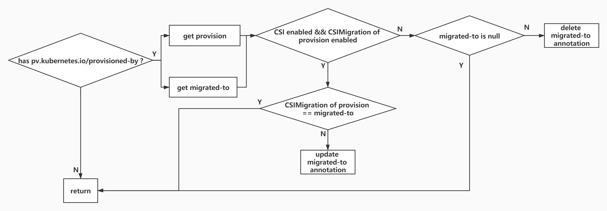

# PV同步逻辑解读

[@sivanzcw](https://github.com/sivanzcw); Apr 4, 2020

## 目录

## 说明

基于K8s [release-1.18](https://github.com/kubernetes/kubernetes/tree/release-1.18)

## `resync`

`resync`函数从`infomer cache`中分别获取pvc和pv对象，并将获取到的pvc和pv对象push到`claimQueue`和`volumeQueue`queue中，等待后续函数
从相应queue中pop出对象并处理。其中`volumeWorker`函数负责pv对象的同步，而pvc对象的同步需要`claimWorker`函数处理。

## `volumeWorker`

`volumeWorker`函数从`volumeQueue`中获取需要同步的pv对象，并做同步处理。从`informer cache`中获取最新的pv信息，如果该对象在
`informer cache`中已经不存在，则说明pv已经被删除了，这个时候，把本地缓存中的pv删掉，如果这个pv已经被绑定到pvc，那么将这个被绑定的pvc强制
push到`claimQueue`中，显示触发相关pvc的sync。当获取到pv对象后，调用`updateVolume`函数开始pv对象的同步。

## `updateVolume`

首先将最新的pv信息刷新至本地缓存中，如果判断pv信息并没有发生变化，则跳过该pv的同步，否则进行`syncVolume`处理。`syncVolume`函数是真正处理pv
状态同步的函数，将处理pv的创建/更新以及周期同步等事件。

`syncVolume`函数首先根据pv的annotation信息判断存储是否涉及`flexvolume`插件向`CSI`驱动的演进。从annotation的
`pv.kubernetes.io/provisioned-by`key获取pv定义的原始`flexvolume`插件名称，从annotation中的`pv.kubernetes.io/migrated-to`
提取`CSI`驱动信息。判断CSI特性是否开启，并判断`flexvolume`插件是否支持向CSI的演进，当两者都为true时，将`flexvolume`插件转换为对应的CSI
驱动名称，如果转换后的CSI驱动名称与原始定义的CSI驱动信息不一致，更新annotation中的`pv.kubernetes.io/migrated-to`，指向新的CSI驱动名称。
如果CSI特性没有开启，或者`flexvolume`插件无法转换为CSI驱动，此时，原始的annotation中又定义了`pv.kubernetes.io/migrated-to`,则，
将key为`pv.kubernetes.io/migrated-to`的annotation删除。

判断`volume.Spec.ClaimRef`是否为nil，如果`volume.Spec.ClaimRef`为nil，说明volume还没有被任何pvc使用，那么将这个pv的状态置为`Available`
并返回。

`volume.Spec.ClaimRef`不为nil，说明卷已经被绑定。判断`volume.Spec.ClaimRef.UID`是否为空，如果UID为空，说明，这个pv卷被预留给一个pvc，
而这个pvc还没有完成卷绑定，这种场景下，pvc的sync逻辑会处理，将卷的状态置为`Available`并返回。

根据`volume.Spec.ClaimRef`获取与pv绑定的pvc的名称，尝试从本地缓存中获取这个pvc。如果从本地缓存中获取不到这个pvc，那么可能这个pvc已经不存
在了，则需要考虑将这个卷释放掉。但是在本地缓存中找不到这个pvc，并不能说明这个pvc真的不存在了，有可能pvc和pv的绑定是外部绑定器做的，比如是由
scheduler做的，但是由于性能问题pvc还没有进入controller的本地缓存，所以在controller的本地缓存中找不到这个pvc。所以如果这个卷的绑定是由
controller管理的，在本地缓存中没有获取到pvc信息后，保险的做法是先从controller的`informer cache`中再次尝试获取，如果仍然获取不到，尝试调用
kube-apiserver的接口获取一次。那么，是不是每次都需要这么处理一下呢，并不然。因为只有卷的状态为非`Released`状态且为非`Failed`状态，且pvc
不存在的时候，才需要将卷置为`Released`状态，因此只有当在本地缓存中没有找到pvc，且卷的状态不是`Released`状态也不是`Failed`状态，才会尝试从
`informer cache`和`kube-apiserver`中获取pvc。如果这个卷的绑定并不是controller管理的，在controller本地缓存中又没有找到这个pvc，则无需
尝试从其他的途径获取pvc。

在经过了上述获取卷所绑定的pvc过程中，仍然存在两种场景，一种是pvc获取到了，一种是pvc没有获取到，而pvc获取到了，仍然不能认为这个获取到的pvc是和
pv绑定在一起的，还需要判断pvc的UID是否与`volume.Spec.ClaimRef.UID`一致，如果不一致，则说明原先这个pv绑定的pvc已经被删除了，而具有同namespace
同名的pvc又被创建了。如果pvc的UID与`volume.Spec.ClaimRef.UID`不一致，仍然认为pvc没有被找到。

如果pvc没有被找到，那么说明这个pvc已经被删掉了，这个时候，如果volume的状态不是`Released`且不是`Failed`，则需要把volume的状态置为`Released`,
然后开始`reclaimVolume`，`recalimVolume`将会根据volume中配置的`volume.Spec.PersistentVolumeReclaimPolicy`来决定对volume做什么操作。
`reclaimVolume`后面再介绍，先把pvc找到的场景叙述完。

pvc找到了，如果pvc的`volumeName`为空，则说明pvc还没有完成bind操作，需要等待pvc完成bind操作。这个时候，需要将pvc强制push到`claimQueue`中，
以使pvc能够尽快得到sync。但有一种场景下，不需要等待pvc bind完成，如果pvc的`volumeMode`与pv的`volumeMode`的不一致。因为在这种场景下，
`syncUnboundClaim`并不会sync这个pvc，因为`findBestMatchForClaim`因为pvc和pv的`volumeMode`不一致，并不会返回`volume`。

如果pvc的`volumeName`与卷的名称一致，那么说明pv和pvc的绑定已经完成，将pv的状态置为`Bound`

如果pvc的`volumeName`与卷的不一致，那么说明虽然这个卷声明绑定到了这个pvc上，但是这个pvc却已经绑定了其他的pv卷。如果这个卷是
`dynamically provisioned` pv,也就是含有`pv.kubernetes.io/provisioned-by`的annotation，并且回收策略是`delete`，也就是
`PersistentVolumeReclaimPolicy`是`delete`，因为本身卷是动态创建，给pvc使用，现在pvc已经绑定了其他的卷，就不需要这个卷了，需要将这个卷释
放掉。如果卷的状态不是`released`或者`failed`状态，将卷的状态刷新成`released`，并调用`reclaimVolume`回收这个卷。

`dynamically provisioned`表示卷的生成是动态生成， 而不是先生成，这样避免每次使用pvc之前都先创建pv。动态卷需要依赖k8s的StorageClass。
StorageClass指向了一个卷插件，也就是`provisioner`，卷插件向卷供应商提供在创建卷时需要的数据卷信息以及相关参数。使用动态卷，只需在pvc的定义
中，指明需要使用的StorageClass名称即可。

如果不是上面这种情况，则需要调用`unbindVolume`函数为卷执行解绑动作

下面介绍`reclaimVolume`和`unbindVolume`两个函数

### `reclaimVolume`

`reclaimVolume`将根据卷配置的资源回收策略，决定对卷的操作。如果卷中配置了CSIMigration，则不再处理这个卷，直接返回，这个时候交给外部
provisioner处理这个卷。当卷回收策略为`Retain`时，不对卷做任何操作。如果卷的回收策略是`Recycle`，则需要执行卷的回收操作，这需要卷所对应的
插件支持卷回收。当卷的回收策略是`Delete`时，则需要执行卷的删除操作。

先看卷的`recycle`，调用kube-apiserver的接口，获取到最新的pv信息，然后判断卷是否已经`released`了，只有卷指定了pvc，且这个指定的pvc不存在，
或者虽然pvc存在，但是pvc的volumeName与卷不符，卷才是`released`状态，需要将卷回收掉。如果卷没有绑定给pvc，那么它的状态应该是`available`，
如果卷被绑定给了某个pvc，但是pvc的UID为空，那么则说明，虽然这个卷绑定给了pvc，但是controller还没有来得及完成pvc的卷绑定。

当卷是处于`released`状态时，获取与该卷绑定的pod列表，并从本地缓存中获取与该卷绑定的pvc。如果这个卷还在被pod使用，但是从本地缓存中获取不到pvc,
name，这个时候，会为卷上报`VolumeFailedRecycle`事件，并停止对改卷的回收。根据卷的spec信息回去到与卷存储相关的插件，并调用插件的`Recycle`
函数，完成卷的回收。最后调用`unbindVolume`函数，完成卷的解绑定。

下面看卷的`delete`操作。依然是先调用kube-apiserver的接口，获取到最新的pv信息，然后判断卷是否已经`released`了，只有卷已经`released`了，才
继续进行后续的删除动作。先调用`doDeleteVolume`函数删除卷所对应的物理存储，然后调用kube-apiserver的接口将pv删除。现在了解一下`doDeleteVolume`
的过程。依然是先调用`findDeletablePlugin`获取到插件，然后调用插件的`Delete`函数，完成物理卷的删除。

最后来看下`unbindVolume`函数，如果卷的绑定是由controller来处理的，也就是卷含有`pv.kubernetes.io/bound-by-controller` annotation，
那么将会把卷的`ClaimRef`置为nil，并将`pv.kubernetes.io/bound-by-controller`annotation去掉。如果卷的绑定不是由controller来处理，那么
将卷的`claimRef.UID`置为空。最后将卷的状态置为`Available`。
